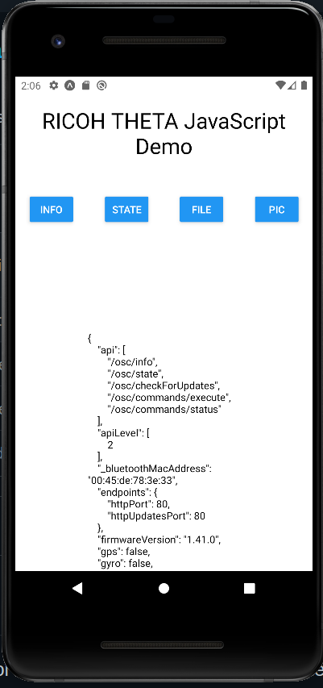

# RICOH THETA JavaScript Demo 

Barebones example of using [theta-javascript](https://github.com/theta360developers/theta-javascript)
in a React Native Expo app.

Works with both fake-theta (no camera API simulator) and a physical device.



## Switch to between fake-theta and real physical device

In `App.js`, change the `urlEndpoint` constant.

```javascript
export default function App() {
  // fake-theta
  const urlEndpoint = "https://fake-theta.vercel.app/osc/";
  // real theta physical device in access point mode
  // const urlEndpoint = "http://192.168.1.1/osc/";

  // end camera endpoint config
```